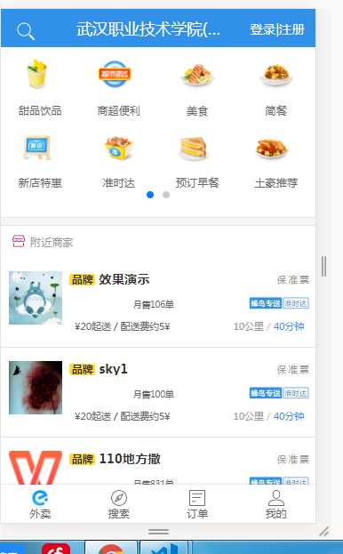
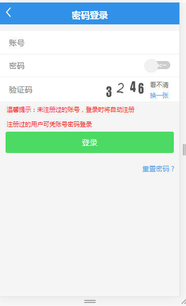
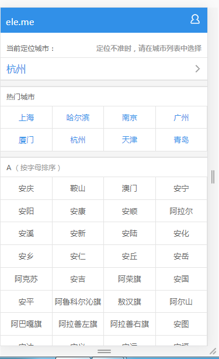
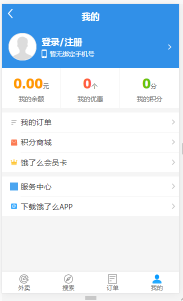

## 说明
这个项目是模仿的这位大神的项目做得，[地址在这里](https://github.com/bailicangdu/vue2-elm)，因为是初学前端和vue，属于摸着石头过河，所以有很多不懂，边做边学阶段。网上的实战项目源码大部分是些简单的demo，所以模仿了这个项目，然后打算精简很多功能，毕竟是个还未入门的小白，后端接口直接用的项目配套的如果有想做完整项目的可以去[这里](https://github.com/bailicangdu/vue2-elm)帮忙点个"Star" 支持一下。项目从零布局配置到现在，会继续完成下去，相对来说注释可能比较多一点，因为是一点一点慢慢自学，所以有很多基础知识注释，希望能对苦于自学没有项目做得人有帮助。
node-elm 后台接口文档: [接口文档地址](https://github.com/bailicangdu/node-elm/blob/master/API.md)。
## 技术栈

vue2 + vuecli + vuex + vue-router + webpack + ES6/7 + axios
## 项目运行

## 注意：由于涉及大量的 ES6/7 等新属性，node 需要 6.0 以上版本

```
git clone 

cd vue2-elm

npm install 或 yarn(推荐)

npm run dev

# 目前功能
- [x] 定位功能 -- 完成
- [x] 选择城市 -- 完成
- [x] 搜索地址 -- 完成 
- [x] 登录、注册 -- 完成
- [x] 修改密码 -- 完成
- [x] 个人中心 -- 完成
- [x] 下载App -- 完成
- [x] 帐户信息 -- 完成
- [x] 服务中心 -- 完成
- [x] 上传头像 -- 完成
- [x] 餐馆食品列表页 -- 完成


# 部分截图
### 商铺列表页



### 登录



### 首页



### 个人中心


# 项目布局

```
.
├── build                                       // webpack配置文件
├── config                                      // 项目打包路径
├── elm                                         // 上线项目文件，放在服务器即可正常访问（这里暂时还未实现）
├── screenshots                                 // 项目截图
├── src                                         // 源码目录
│   ├── components                              // 组件
│   │   ├── common                              // 公共组件
│   │   │   ├── alertTip.vue                    // 弹出框组件   F
│   │   │   ├── buyCart.vue                     // 购物车组件   F
│   │   │   ├── computeTime.vue                 // 倒计时组件   F
│   │   │   ├── loading.vue                     // 页面初始化加载数据的动画组件     F
│   │   │   ├── mixin.js                        // 组件混合(包括：指令-下拉加载更多，处理图片地址)
│   │   │   ├── ratingStar.vue                  // 评论的五颗星组件     F
│   │   │   └── shoplist.vue                    // msite和shop页面的餐馆列表公共组件    
│   │   ├── footer
│   │   │   └── foot.vue                   // 底部公共组件
│   │   └── header
│   │       └── head.vue                        // 头部公共组件
│   ├── config                                  // 基本配置
│   │   ├── env.js                              // 环境切换配置
│   │   ├── fetch.js                            // 获取数据     (我用的是axios)
│   │   ├── mUtils.js                           // 常用的js方法 
│   │   └── rem.js                              // px转换rem
│   ├── images                                  // 公共图片
│   ├── page
│   │   ├── city
│   │   │   └── city.vue                        // 当前城市页
│   │   ├── download
│   │   │   └── download.vue                    // 下载App
│   │   ├── find
│   │   │   └── find.vue                        // 发现页
│   │   ├── food
│   │   │   └── food.vue                        // 食品筛选排序页
│   │   ├── forget
│   │   │   └── forget.vue                      // 忘记密码，修改密码页
│   │   ├── home
│   │   │   └── home.vue                        // 首页
│   │   ├── login
│   │   │   └── login.vue                       // 登录注册页
│   │   ├── miste
│   │   │   └── miste.vue                       // 商铺列表页
│   │   ├── order
│   │   │   ├── children
│   │   │   │   └── orderDetail.vue             // 订单详情页   F
│   │   │   └── order.vue                       // 订单列表页
│   │   ├── profile
│   │   │   ├── children
│   │   │   │   ├── children
│   │   │   │   │   ├── address.vue             // 地址
│   │   │   │   │   └── setusername.vue             // 重置用户名
│   │   │   │   ├── info.vue                    // 帐户信息
│   │   │   └── profile.vue                     // 个人中心
│   │   ├── search
│   │   │   └── search.vue                      // 搜索页
│   │   ├── service
│   │   │   ├── children
│   │   │   │   └── questionDetail.vue          // 问题详情
│   │   │   └── service.vue                     // 服务中心
│   │   ├── shop            F
│   │   │   ├── children
│   │   │   │   ├── children
│   │   │   │   │   └── shopSafe.vue            // 商铺认证信息页
│   │   │   │   ├── foodDetail.vue              // 商铺信息页
│   │   │   │   └── shopDetail.vue              // 单个商铺信息页
│   │   │   └── shop.vue                        // 商铺筛选页
│   │   └── vipcard                     F
│   │       ├── children
│   │       │   ├── invoiceRecord.vue           // 购买记录
│   │       │   ├── useCart.vue                 // 使用卡号购买
│   │       │   └── vipDescription.vue          // 会员说明
│   │       └── vipcard.vue                     // 会员卡办理页
│   ├── plugins                                 // 引用的插件
│   ├── router
│   │   └── router.js                           // 路由配置
│   ├── service                                 // 数据交互统一调配
│   │   ├── getData.js                          // 获取数据的统一调配文件，对接口进行统一管理
│   │   └── http.js                             // axios封装方法
│   ├── store                                   // vuex的状态管理
│   │   ├── action.js                           // 配置actions
│   │   ├── getters.js                          // 配置getters
│   │   ├── index.js                            // 引用vuex，创建store
│   │   ├── modules                             // store模块
│   │   ├── mutation-types.js                   // 定义常量muations名
│   │   └── mutations.js                        // 配置mutations
│   └── style
│       ├── common.scss                         // 公共样式文件
│       ├── mixin.scss                          // 样式配置文件
│       └── swiper.min.css
│   ├── App.vue                                 // 页面入口文件
│   ├── main.js                                 // 程序入口文件，加载各种公共组件
├── favicon.ico                                 // 图标
├── index.html                                  // 入口html文件